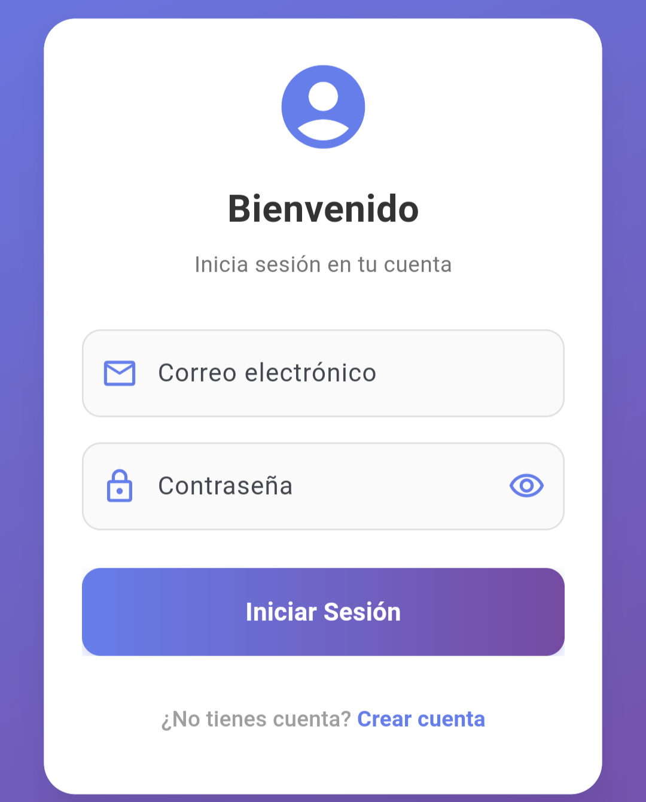
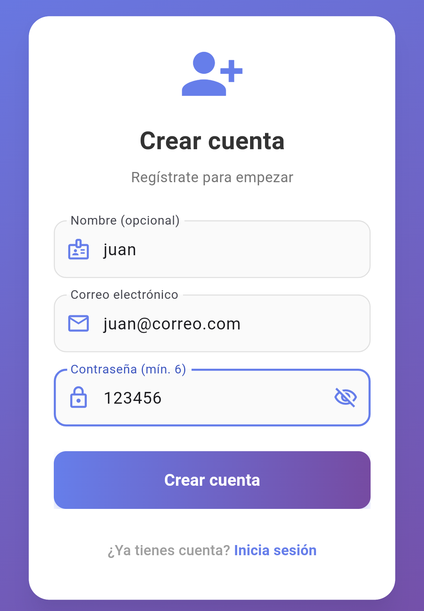
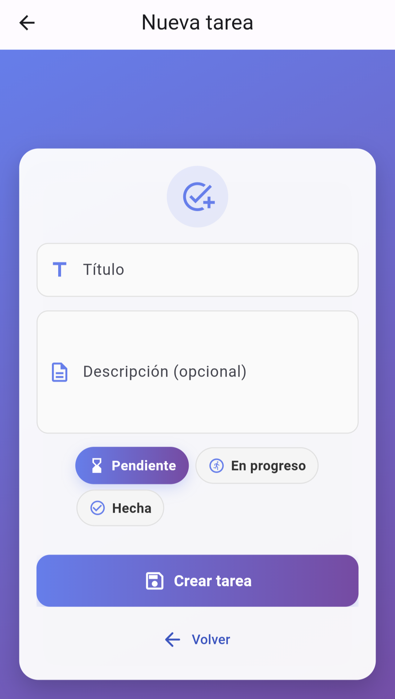
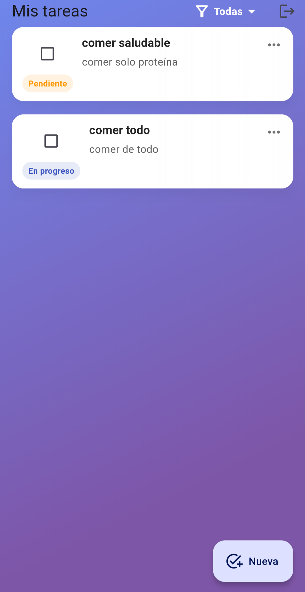
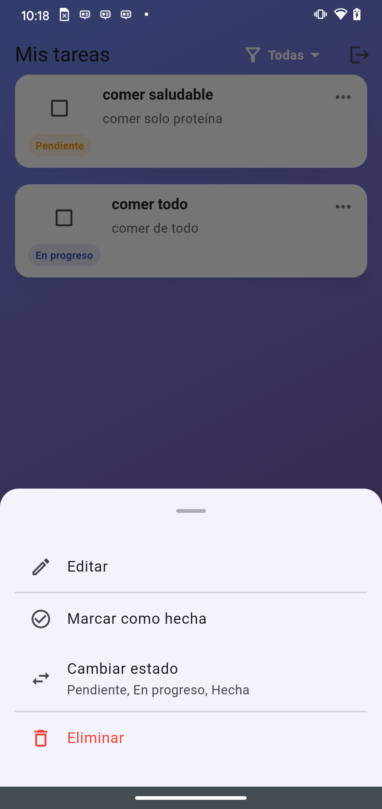
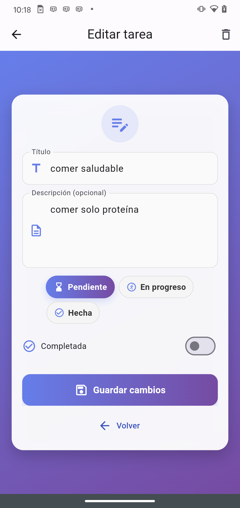
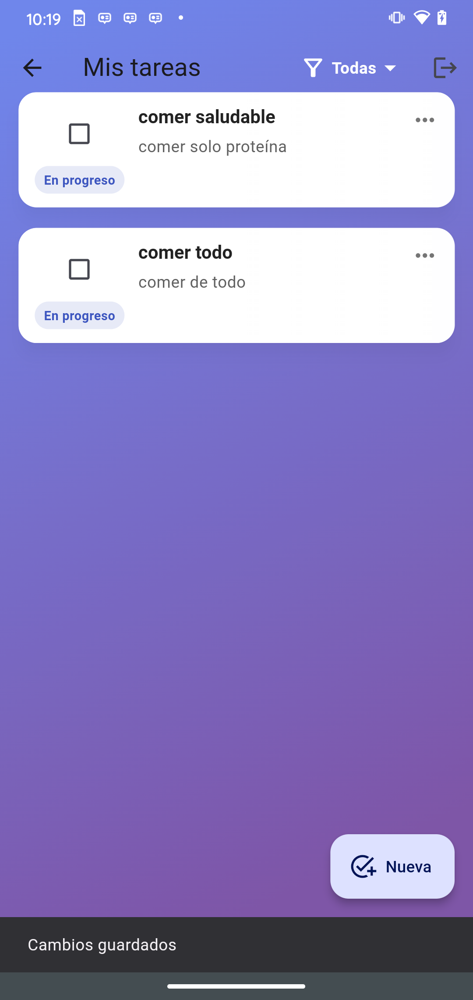
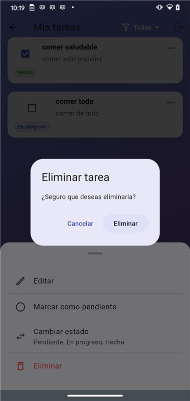
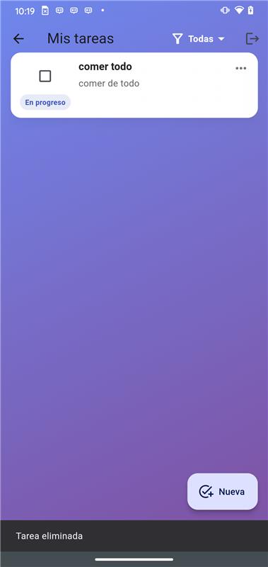
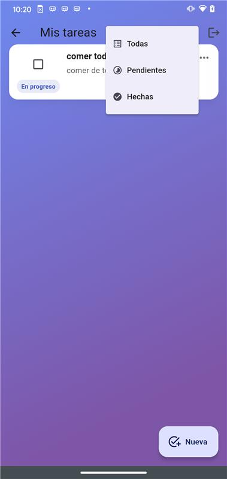

<h1 align="center">📌 Multi-Task - Gestor de Tareas</h1>

<p align="center">
  <strong>Aplicación completa de gestión de tareas</strong> compuesta por un backend desarrollado con <b>NestJS</b> y un frontend móvil en <b>Flutter</b>.
</p>

---

<h2>📖 Descripción del Proyecto</h2>

<p>
Este proyecto es una aplicación completa de gestión de tareas (<b>Task Manager</b>) que permite a un usuario autenticado <b>crear, consultar, actualizar y eliminar tareas</b> de manera sencilla, rápida y segura.  
Toda la información se almacena en una base de datos <b>PostgreSQL alojada en Neon</b>, y las operaciones están protegidas mediante <b>autenticación JWT</b>.
</p>

<ul>
  <li><b>Backend</b>
    <ul>
      <li>Implementado en <b>NestJS</b> con <b>TypeORM</b>.</li>
      <li>CRUD completo de tareas con filtros, búsqueda, cambio de estado y marcado como completadas.</li>
      <li>Sistema de autenticación y autorización para garantizar que solo usuarios registrados puedan acceder a las funcionalidades.</li>
      <li>Desplegado en <b>Render</b>.</li>
    </ul>
  </li>
  <li><b>Frontend móvil</b>
    <ul>
      <li>Desarrollado con <b>Flutter</b> (solo Android).</li>
      <li>Permite iniciar sesión, gestionar tareas y ver cambios en tiempo real.</li>
      <li>Funcionalidades de búsqueda, filtrado y marcado rápido de tareas.</li>
      <li>Interfaz optimizada para una experiencia fluida.</li>
    </ul>
  </li>
</ul>

---

<h2>🛠 Manual de Uso</h2>

<p>Para ejecutar este proyecto localmente es necesario:</p>

<ol>
  <li><b>Tener instalado Flutter</b> (versión 3.x o superior).</li>
  <li><b>Android Studio</b> para manejar el emulador.</li>
  <li>Configurar un <b>AVD (Android Virtual Device)</b>, preferiblemente un Pixel con Android 13 o superior.</li>
  <li><b>Java 17</b> instalado y configurado como predeterminado.</li>
</ol>

<p>💡 <b>Nota:</b> El backend ya está desplegado en Render, por lo que no es necesario ejecutarlo localmente.</p>

---

<h3>🔗 Configuración del Frontend</h3>

<p>En el código de Flutter, configurar la URL base de la API en un archivo como <code>constants.dart</code> o <code>app_config.dart</code>:</p>

```dart
const String BASE_URL = "https://multi-task.onrender.com/api";

<h4>Comandos para ejecutar el frontend:</h4>

flutter pub get
flutter run

<h2>📡 Endpoints del Backend</h2> <table> <tr> <th>Método</th> <th>Endpoint</th> <th>Descripción</th> </tr> <tr><td>POST</td><td>/api/auth/register</td><td>Registrar un nuevo usuario</td></tr> <tr><td>POST</td><td>/api/auth/login</td><td>Iniciar sesión y obtener JWT</td></tr> <tr><td>GET</td><td>/api/users/me</td><td>Obtener perfil del usuario autenticado</td></tr> <tr><td>GET</td><td>/api/tasks</td><td>Listar tareas con filtros y búsqueda</td></tr> <tr><td>GET</td><td>/api/tasks/:id</td><td>Obtener una tarea por ID</td></tr> <tr><td>POST</td><td>/api/tasks/create</td><td>Crear nueva tarea</td></tr> <tr><td>PUT</td><td>/api/tasks/:id</td><td>Actualizar una tarea completa</td></tr> <tr><td>PATCH</td><td>/api/tasks/:id/status</td><td>Cambiar estado de tarea</td></tr> <tr><td>PATCH</td><td>/api/tasks/:id/toggle</td><td>Alternar completado</td></tr> <tr><td>DELETE</td><td>/api/tasks/:id/delete</td><td>Eliminar una tarea</td></tr> <tr><td>GET</td><td>/api/health</td><td>Estado general del backend</td></tr> <tr><td>GET</td><td>/api/health/database</td><td>Estado de la base de datos</td></tr> <tr><td>GET</td><td>/api/health/detailed</td><td>Estado detallado del sistema</td></tr> </table> <p><b>📍 Base URL:</b> <code>"https://multi-task.onrender.com/api"</code></p>

<h2>🌐 URL de despliegue del backend</h2> 

<p>🔗 <a href="https://multi-task.onrender.com" target="_blank">"https://multi-task.onrender.com"</a></p>


<h2>📸 Evidencia Fotográfica</h2>

 <p align="center">           </p>

<h2>🤖 Uso de Inteligencia Artificial en el Desarrollo </h2> 
<p> Durante el desarrollo del proyecto se utilizaron herramientas de inteligencia artificial como <b>ChatGPT</b> y <b>Cursor AI</b> con el objetivo de agilizar el flujo de trabajo y obtener orientación en la implementación de ciertas funcionalidades. Estas herramientas sirvieron como apoyo para resolver dudas técnicas, proponer soluciones y optimizar el tiempo de desarrollo, <b>sin sustituir el criterio y las decisiones técnicas tomadas por el equipo</b>. </p> ```