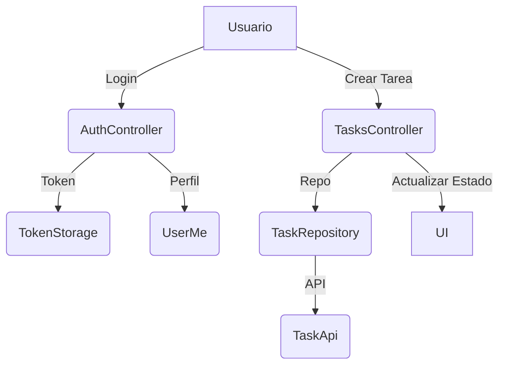

# Documentación del Frontend (Mobile)

## Índice
1. Introducción
2. Estructura del Proyecto
3. Principales Funcionalidades
4. Arquitectura y Tecnologías
5. Detalles de Implementación
6. Gestión de Estado
7. Seguridad
8. Pruebas
9. Ejecución y Deploy
10. Consideraciones Finales

---

## 1. Introducción
Este documento describe el desarrollo del frontend móvil de la aplicación "multi-task", realizado con Flutter. El objetivo principal es proveer una interfaz intuitiva y eficiente para la gestión de tareas y autenticación de usuarios.

## 2. Estructura del Proyecto
La estructura principal del proyecto se encuentra en la carpeta `mobile/` y está organizada de la siguiente manera:
- **lib/**: Código fuente principal.
  - **core/**: Componentes reutilizables, manejo de errores, almacenamiento de tokens, configuración de entorno, etc.
  - **features/**: Módulos funcionales (autenticación, tareas, etc.).
- **assets/**: Recursos gráficos y archivos estáticos.
- **test/**: Pruebas unitarias y de widgets.
- **android/**, **windows/**: Archivos de configuración y código nativo para cada plataforma.

## 3. Principales Funcionalidades
- **Autenticación de usuarios**: Registro, inicio de sesión y manejo de tokens JWT.
- **Gestión de tareas**: Crear, editar, eliminar y listar tareas.
- **Persistencia segura**: Uso de almacenamiento seguro para credenciales y datos sensibles.
- **Interfaz adaptativa**: UI responsiva para diferentes dispositivos y plataformas.

## 4. Arquitectura y Tecnologías
- **Framework principal**: Flutter (Dart)
- **Gestión de dependencias**: `pubspec.yaml`
- **Comunicación con backend**: HTTP usando la librería Dio, mapeo de errores y manejo de excepciones.
- **Gestión de estado**: Se utiliza un patrón basado en Result y manejo de estados en los módulos de features.
- **Almacenamiento seguro**: Integración con `flutter_secure_storage`.

## 5. Detalles de Implementación

## 5.1 Peticiones al Backend
Las peticiones al backend se realizan principalmente usando la librería Dio, configurada en `core/http.dart`. Todas las llamadas HTTP pasan por clases como `TaskApi`, `AuthRepository` y son orquestadas por los controladores (`TasksController`, `AuthController`).

**Ejemplo de petición para crear una tarea:**
```dart
Future<Task> create({required String title, String? description, TaskStatus? status}) =>
    api.create(title: title, description: description, status: status);
```
**Ejemplo de petición de login:**
```dart
Future<void> login(LoginDto dto) async {
  final response = await dio.post('/auth/login', data: dto.toJson());
  // Manejo de respuesta y almacenamiento de token
}
```

## 5.2 Manejo de Errores
El manejo de errores se realiza mediante excepciones personalizadas (`AppException`) y el patrón Result. Cuando ocurre un error en una petición, se captura y se transforma en un estado de error para la UI.

**Ejemplo de manejo de error en una operación asíncrona:**
```dart
state = await AsyncValue.guard(() async {
  await _repo.login(LoginDto(email, password));
  final me = await _repo.me();
  return me;
});
```
Si ocurre un error, el estado se actualiza automáticamente y la UI puede mostrar un mensaje adecuado.

**Ejemplo de excepción personalizada:**
```dart
class AppException implements Exception {
  final String message;
  final int? status;
  AppException(this.message, {this.status});
  @override
  String toString() => status != null ? '[$status] $message' : message;
}
```

## 5.3 Programación Asíncrona
La programación asíncrona se utiliza en todas las operaciones que involucran peticiones al backend, lectura/escritura de almacenamiento seguro y actualización de estado. Se emplean `Future`, `AsyncNotifier`, y el método `AsyncValue.guard` para manejar estados de carga y error.

**Ejemplo de uso de Future y AsyncNotifier:**
```dart
class AuthController extends AsyncNotifier<UserMe?> {
  @override
  Future<UserMe?> build() async {
    try {
      final hasToken = await ref.read(tokenStorageProvider).read() != null;
      if (!hasToken) return null;
      final user = await _repo.me();
      return user;
    } catch (_) {
      await _repo.logout();
      return null;
    }
  }
}
```
Esto permite que la UI reaccione automáticamente a los cambios de estado (cargando, error, datos) y que las operaciones no bloqueen el hilo principal.

## 6. Gestión de Estado
El estado se gestiona principalmente a través de modelos y servicios en cada módulo de features. Se utiliza el patrón Result para diferenciar entre estados exitosos y fallidos, facilitando el manejo de errores y la retroalimentación al usuario.

## 7. Seguridad
- **Almacenamiento seguro**: Uso de `flutter_secure_storage` para guardar tokens y credenciales.
- **Validación de datos**: Validaciones en formularios y manejo de errores en la comunicación con el backend.

## 8. Pruebas
- **Ubicación**: Carpeta `test/`
- **Tipos**: Pruebas unitarias de lógica y pruebas de widgets para UI.
- **Herramientas**: Framework de pruebas de Flutter.

## 9. Ejecución y Deploy
- **Desarrollo**: Ejecutar `flutter run` en la raíz del proyecto móvil.
- **Compilación**: Uso de los scripts y archivos de configuración en `android/` y `windows/` para generar builds nativos.
- **Dependencias**: Instalar dependencias con `flutter pub get`.

## 10. Consideraciones Finales

## Ejemplos de Código y Flujos

### Ejemplo: Flujo de Autenticación
```dart
// Login desde AuthController
Future<void> login({required String email, required String password}) async {
  state = const AsyncLoading();
  state = await AsyncValue.guard(() async {
    await _repo.login(LoginDto(email, password));
    final me = await _repo.me();
    return me;
  });
}
```
**Flujo:**
1. El usuario ingresa email y contraseña.
2. Se actualiza el estado a `AsyncLoading`.
3. Se realiza la petición de login y se obtiene el perfil.
4. El estado se actualiza con el usuario autenticado o error.

### Ejemplo: Manejo de Tareas
```dart
// Crear tarea desde TasksController
Future<void> create({required String title, String? description, TaskStatus? status}) async {
  ref.read(taskMutatingProvider.notifier).state = true;
  await AsyncValue.guard(() async {
    await _repo.create(title: title, description: description, status: status);
    await refresh();
  });
  ref.read(taskMutatingProvider.notifier).state = false;
}
```
**Flujo:**
1. El usuario ingresa los datos de la tarea.
2. Se activa el flag de mutación (`taskMutatingProvider`).
3. Se crea la tarea y se refresca la lista.
4. Se desactiva el flag y se actualiza la UI.

### Ejemplo: Uso de Result
```dart
final Result<Task> result = await someAsyncOperation();
result.match(
  ok: (task) => print('Tarea creada: ${task.title}'),
  err: (error) => print('Error: $error'),
);
```
**Flujo:**
1. Se realiza una operación asíncrona que retorna un `Result`.
2. Se utiliza el método `match` para manejar el resultado exitoso o el error.

### Diagrama Simplificado de Flujo



---

**Autor:** Equipo de desarrollo
**Fecha:** 11 de agosto de 2025


